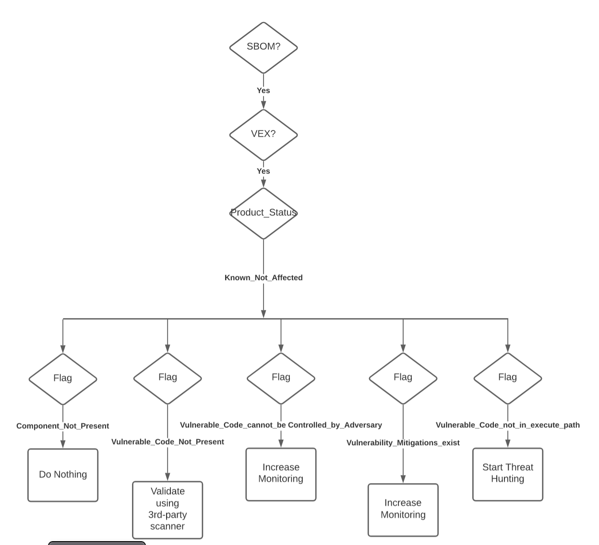

# Security Posture by Example

## Scenario 5 - Heightened Threat, Increased Monitoring
This scenario is similar to Scenario 3 except the CSAF/VEX comes back
with
- status = NOT_AFFECTED
- status justification = vulnerable_code_cannot_be_controlled_by_adversary.

Although the HMO does trust that the vendor
used the correct status justification,
the HDO security policy is to increase monitoring in this situation.
So the CACAO playbook increases monitoring on the device with the
potentially vulnerable component.

Here is the policy as implemented in CACAO
.
See
{add link to actual CACAO playbook in use case section}
for the actual CACAO playbook.
See
{add link to actual PACE usecases in use case section}.
See
{add link to actual OpenC2 usecases in use case section}.
